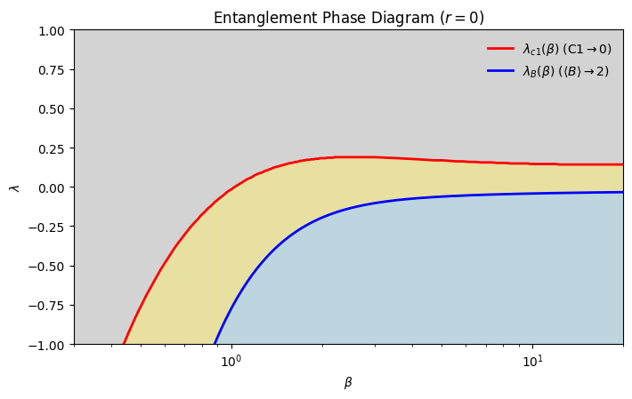

# Entanglement Phase Transitions in the SSH Model at Finite Temperature



Numerical study of finite-temperature entanglement transitions in the Su–Schrieffer–Heeger (SSH) model using correlation matrix methods.

This repository contains the numerical codes used to analyze entanglement properties of the SSH model at finite temperature. The project investigates how bipartite entanglement and Bell nonlocality behave in a one–dimensional topological system as functions of temperature and the dimerization parameter.

The analysis is based on the **correlation matrix formalism for free fermionic systems**, which allows the computation of reduced density matrices and entanglement measures directly from the single-particle Hamiltonian.

This work was developed as part of the MSc thesis:

**“Entanglement Phase Transitions in 1D Topological Insulators”**

---

# Physical Model

We study the SSH Hamiltonian

\[
H(k) =
\begin{pmatrix}
0 & h(k) \\
h^*(k) & 0
\end{pmatrix}
\]

with

\[
h(k) = 1 + \lambda e^{-ik}
\]

where

- \( \lambda \) is the dimerization parameter  
- \( k \) is the crystal momentum  
- \( \beta = 1/T \) is the inverse temperature  

Using the correlation matrix formalism, we compute two–site reduced density matrices and evaluate entanglement quantities such as **concurrence** and **Bell inequality violation**.

The main objective is to determine the **critical dimerization values**

\[
\lambda_c(\beta)
\]

that characterize entanglement phase transitions as temperature varies.

---

# Repository Structure

sahinel_valorization_codes/

├── src/
│ ├── init.py
│ └── periodic_chain_functions.py
│ Core numerical routines implementing the SSH model and entanglement calculations.

├── notebooks/
│ └── periodic_chain.ipynb
│ Main analysis notebook used to run simulations and generate figures.

├── data/
│ └── periodic/
│ ├── lambda_critical_vs_beta.csv
│ └── lambda_critical_bell_vs_beta.csv
│ Numerical datasets generated during the simulations.

├── figures/
│ └── periodic/
│ Collection of publication-quality figures produced from the analysis.

├── environment.yml
│ Conda environment specification required to run the project.

└── README.md
Project documentation.


---

# Core Code (`src/`)

The `src` directory contains the main numerical implementations used throughout the project.

The module periodic_chain_functions.py

implements functions for

- constructing the SSH Hamiltonian  e  
- evaluating concurrence  
- computing Bell inequality measures  
- determining critical dimerization values \( \lambda_c(\beta) \)

These functions form the computational backbone of the analysis.

---

# Notebook

The main notebook notebooks/periodic_chain.ipynb

contains the workflow used in the project:

- generation of numerical datasets  
- computation of entanglement measures  
- determination of critical parameters  
- generation of plots and figures  

---

# Data

The `data/` directory contains CSV files generated from the numerical simulations.

Examples include

- critical dimerization values obtained from concurrence  
- critical dimerization values obtained from Bell inequality analysis  

These datasets are used to produce the figures and asymptotic fits presented in the study.

---

# Figures

The `figures/` directory contains all figures generated during the analysis, including

- SSH band structure  
- occupation spectra  
- concurrence curves for different temperatures  
- finite-size comparisons  
- critical parameter curves  
- entanglement phase diagrams  
- asymptotic fits of \( \lambda_c(\beta) \)

All figures are stored as ** PDF files**.

---

# Running the Code

To reproduce the environment:

```bash
conda env create -f environment.yml
conda activate ssh_entanglement

Then open the main notebook

notebooks/periodic_chain.ipynb
to reproduce the numerical analysis and figures.


